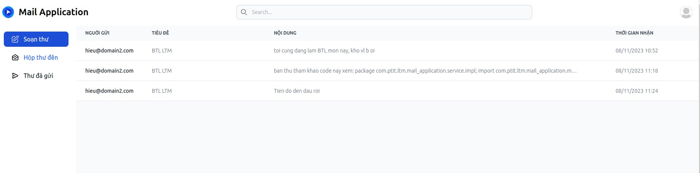
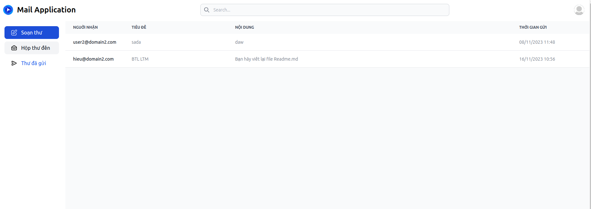
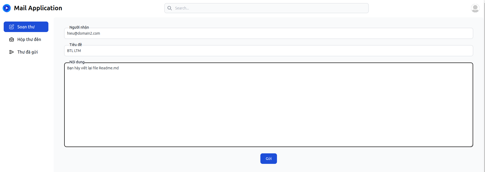
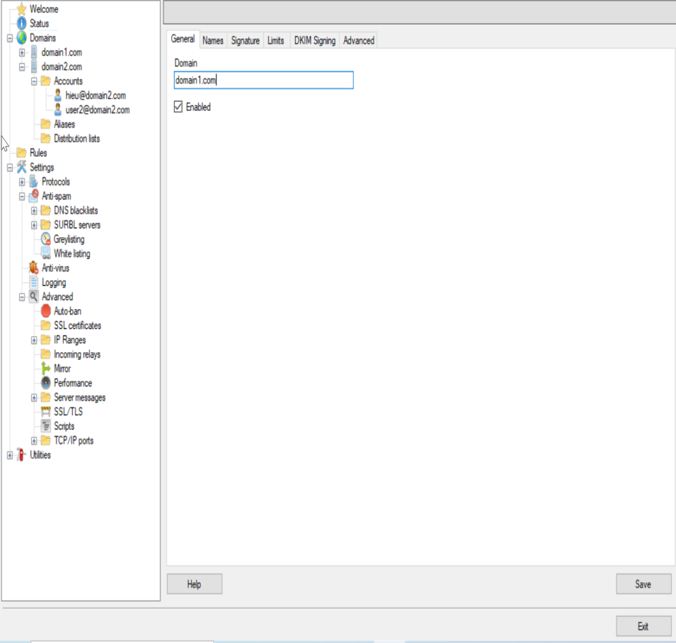
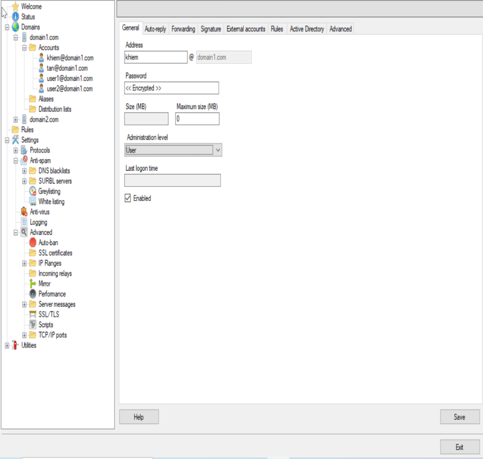

# g3_proj248757381
## CHỦ ĐỀ

Ứng dụng mail client với những chức năng cơ bản của 1 mail-client như sau: Gửi, nhận, xóa, reply, gửi thư đính kèm file, …

## THÔNG TIN NHÓM:
+ Kiều Ngọc Khiêm - B20DCCN381
+ Trần Minh Tân - B20DCCN757
+ Lê Minh Hiếu - B20DCCN248

## CÔNG NGHỆ SỬ DỤNG
+ Hmail Server: Hmail Server được sử dụng làm máy chủ email để xử lý việc gửi và nhận email.
+ Spring Boot: Ứng dụng được xây dựng bằng Spring Boot, một framework phát triển ứng dụng Java nhanh chóng và dễ dàng.
+ Thymeleaf: Hỗ trợ dựng giao diện MVC với Spring Boot

## MÔ TẢ KIÊN TRÚC, GIAO TIẾP, CHỨC NĂNG CHÍNH

# Kiến Trúc
Ứng dụng Mail Client có kiến trúc client-server, trong đó:
+ Client: Giao diện người dùng (UI) của ứng dụng. Giao diện này cho phép người dùng tương tác với email thông qua các chức năng cơ bản như gửi, nhận, trả lời, xóa email và gửi email có đính kèm file.
+ Server: Bao gồm máy chủ SMTP và IMAP. Máy chủ SMTP (Simple Mail Transfer Protocol) được sử dụng để gửi email từ ứng dụng đến máy chủ email của người nhận. Máy chủ IMAP (Internet Message Access Protocol) được sử dụng để nhận và đọc email từ máy chủ email của người dùng

# Giao tiếp
Các thành phần trong kiến trúc giao tiếp với nhau như sau:
+ Client <-> Server SMTP: Khi người dùng gửi email, ứng dụng client gửi yêu cầu đến máy chủ SMTP. Máy chủ SMTP xác thực và gửi email đến máy chủ email của người nhận.
+ Client <-> Server IMAP: Khi người dùng muốn xem email đã nhận, ứng dụng client gửi yêu cầu đến máy chủ IMAP. Máy chủ IMAP trả về email cho ứng dụng client để hiển thị.

# Chức năng chính
Ứng dụng Mail Client cung cấp các chức năng chính sau:

+ Gửi Email: Người dùng có thể viết và gửi email cho người khác, bao gồm việc gửi thư đi kèm file.
+ Nhận Email: Người dùng có thể xem, đọc và quản lý email đã nhận từ máy chủ email của họ.
+ Trả Lời và Chuyển Tiếp Email: Người dùng có thể trả lời hoặc chuyển tiếp email cho người khác.
+ Quản Lý Thư Mục và Nhãn: Ứng dụng cho phép người dùng tạo và quản lý thư mục và nhãn để sắp xếp và phân loại email.
+ Xóa Email: Người dùng có thể xóa email đã nhận.
+ Đính Kèm File: Ứng dụng hỗ trợ việc đính kèm file vào email được gửi.

# Preview giao diện
Giao diên thư nhận

Giao diện thư đã gửi

Giao diện gửi thư

# Cài đặt môi trường
Cài đặt môi trường với Java 11

Cài đặt Hmail Server từ link sau: https://www.hmailserver.com/download

Tạo 1 domain mới

Tạo các account mới trên hmail server

# Triển khai
## Bộ rule để lọc thư: 
+ Chặn thư theo domain
+ Chặn thư theo email nguồn
+ Chặn thư dựa trên từ khóa trong nội dung email
